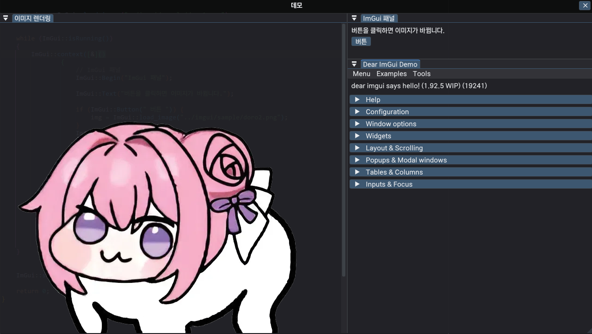
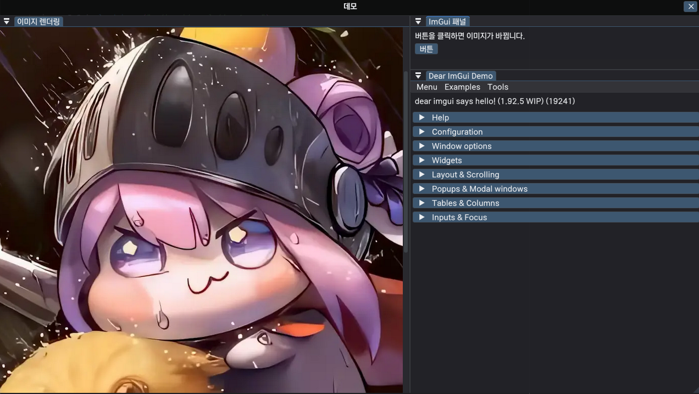

# Imgui
* ImGui와 ImPlot를 쉽게 셋업하기 위해 만들었습니다.
* 간단한 래핑 클래스로 쉽게 사용할 수 있습니다.
* ImPlot과 ImPlot3D가 포함되어 있습니다.




<br>

> 참고: Example을 비활성화 하려면 CMakeLists.txt에서 EXAMPLE_IMGUI를 FALSE로 설정하세요.

<br>

## 프로젝트 구조
```text
workspace/
├── 3rdparty/
│   └── imgui/
├── main.cpp
└── CMakeLists.txt
```

<br>


## 종속성
* GLFW3 설치
```shell
  sudo apt install libglfw3 libglfw3-dev
```

<br>

## 설치
* 예시로, 3rdparty에 git clone을 실행합니다
```shell
  mkdir 3rdparty && cd 3rdparty
  git clone https://github.com/Min-J6/lib_ImGui.git
```

<br>

## 프로젝트에 추가
* 프로젝트 메인 CMakeLists.txt에 다음을 추가하세요
```cmake
add_subdirectory(3rdparty/imgui)

target_link_libraries(your_target PRIVATE lib_imgui)
```

<br>

## 이 프로젝트는 다음 오픈소스 라이브러리를 사용합니다
- **ImGui** (MIT License): Dear ImGui 라이브러리 (https://github.com/ocornut/imgui)
- **ImPlot** (MIT License): ImGui 기반 플로팅 라이브러리 (https://github.com/epezent/implot)
- **ImPlot3D** (MIT License): 3D 플로팅 라이브러리 (https://github.com/brenocq/implot3d)
- **ImCoolBar** (MIT License): ImGui 툴바 컴포넌트 (https://github.com/aiekick/ImCoolBar)

각 라이브러리의 라이선스는 해당 라이브러리의 LICENSE 파일을 참조하세요. 이 프로젝트의 전체 라이선스는 [LICENSE.txt](LICENSE.txt)를 확인하세요.

프로젝트에 기여하거나 이슈를 제기하려면 GitHub 리포지토리를 방문하세요.